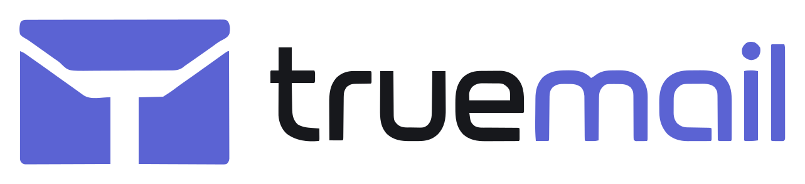

[English](README.md) · **Русский**

<p align="center">
  
</p>

<p align="center">
  Почтовый клиент для компьютера с открытым исходным кодом, написанный на Rust.
</p>

---

Программа работает на вашем компьютере: письма, календари и контакты хранятся
локально в зашифрованной базе. Поддерживаются Яндекс и Gmail.

## Что умеет

Почта:

- Подключение Яндекса и Gmail по OAuth, без ввода пароля от ящика.
- Получение писем по IMAP; новые письма приходят сразу, без ожидания опроса.
- Отправка через SMTP, черновики, вложения, отправка по расписанию.
- Очередь отправки: если сети нет, письмо уйдёт при следующем подключении.
- Группировка переписки в беседы.
- Умные папки по условиям, сквозные папки по всем ящикам, правила обработки, метки.
- Поиск по письмам, в том числе если текст набран не в той раскладке.

Календари и контакты:

- Яндекс: календари и контакты по CalDAV и CardDAV.
- Gmail: календари, контакты и задачи через сервисы Google.
- Напоминания о встречах.

Интерфейс:

- Русский и английский языки.
- Светлая и тёмная темы, выбор цвета оформления, три плотности списка.
- Два режима: обычный и режим эксперта с дополнительными настройками.
- Свои уведомления о новых письмах, значок в системном трее, запуск при старте системы.

## Сборка и запуск

```sh
make setup     # установить tauri-cli и sqlx-cli (один раз)
make dev       # запустить программу
```

Схема базы обновляется автоматически при запуске. На Windows при первой сборке
скачивается проверенная переносимая сборка Strawberry Perl в папку `temp/`,
если полного Perl нет в `PATH` — он нужен только во время сборки.

После остановки `make dev` удаляются только те файлы сборки, которыми не
пользовались 30 дней. Посмотреть список заранее: `make sweep-preview`.

## Подключение почты

Готовая программа подключает ящики сама. Если вы собираете её из исходников,
нужно зарегистрировать своё приложение у Яндекса и Google и указать выданные
идентификаторы: в репозитории их нет.

Скопируйте `.env.example` в `.env` и заполните значения. Файл `.env` в Git не
попадает, `make dev` читает его при сборке.

```dotenv
TRUEMAIL_YANDEX_CLIENT_ID=идентификатор_приложения_яндекса
TRUEMAIL_YANDEX_REDIRECT_URI=http://127.0.0.1:34982/oauth/yandex/callback
TRUEMAIL_GOOGLE_CLIENT_ID=идентификатор_приложения_google
TRUEMAIL_GOOGLE_CLIENT_SECRET=строка_выданная_google
```

Яндексу пароль приложения не нужен. Google выдаёт его даже для программ на
компьютере и требует при подключении, поэтому он указывается здесь.

Яндекс: приложение с типом `Веб-сервисы`, точный адрес для ответа
`http://127.0.0.1:34982/oauth/yandex/callback`, права `mail:imap_full`,
`mail:smtp`, `calendar:all`, `directory:read_external_contacts`,
`directory:write_external_contacts`.

Google: проект в [Google Cloud Console](https://console.cloud.google.com/),
включённый `Gmail API`, право доступа `https://mail.google.com/` и приложение
с типом `Desktop app`. Адрес для ответа указывать не нужно: программа принимает
ответ на временный адрес `http://127.0.0.1` со случайным портом.

## Хранение данных

При первом запуске вы выбираете язык, знакомитесь с процессом, выбираете папку для данных и создаёте ключи
шифрования, двигая мышью. Случайные движения смешиваются со случайными числами
операционной системы — так ключ нельзя предсказать. Ключи хранятся в системном
хранилище паролей.

Зашифрована вся база целиком, включая служебные данные и поисковый индекс.
Тексты писем и вложения шифруются отдельно. Пароли от ящиков программа не
хранит и не видит: доступ выдаётся по OAuth.

## Структура

```
crates/core/            ядро: модели, транспорт, хранилище, поиск, шифрование
  migrations/           схема базы данных
  src/model/              общая модель (письмо, событие, контакт, аккаунт, папка)
  src/backend/             работа с IMAP и SMTP Яндекса и Gmail
  src/storage/             зашифрованная база и хранилище вложений
  src/crypto/              шифрование данных, ключи в системном хранилище
  src/search/               поиск с учётом раскладки клавиатуры
  src/account/              аккаунты и автоматическая настройка
  src/i18n/                  переводы
apps/desktop/            программа для компьютера
  src-tauri/                связь интерфейса с ядром
  ui/                       интерфейс, модули и JSON-каталоги RU/EN
```

## Лицензия

Двойное лицензирование: [AGPL-3.0](LICENSE) (открытая) + коммерческая лицензия для
тех, кто не хочет открывать свой код. Подробности — в [LICENSING.md](LICENSING.md).
По коммерческим вопросам: bintocher@yandex.com.

## Участие в разработке

См. [CONTRIBUTING.md](CONTRIBUTING.md). Вклад принимается на условиях
[CLA.md](CLA.md).

## Безопасность

О том, как сообщить об уязвимости, см. [SECURITY.md](SECURITY.md).

## Поддержать

Проект бесплатный и открытый. [Поддержать разработку](DONATE.md).
